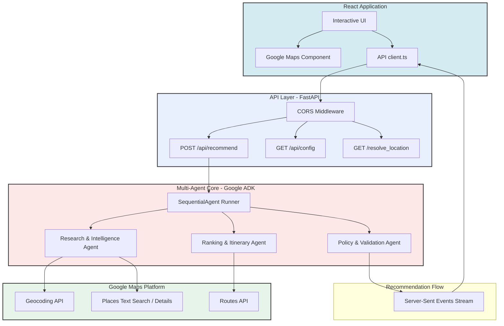

# TravelWell AI

### *Find Your Perfect Workout. Anywhere. Anytime.*

**Powered by Explainable Multi-Agent AI — Every recommendation explained.**

[](https://www.python.org/)
[](https://react.dev/)
[](https://github.com/google/adk)
[](https://cloud.google.com/run)
[](https://cloud.google.com/vertex-ai)
[](https://developers.google.com/maps)
[](LICENSE)

---

## 🌟 Overview

TravelWell AI is an explainable multi-agent concierge that helps travelers find fitness facilities matching their location, schedule, memberships, budget, and wellness preferences.

Unlike traditional search, TravelWell uses an orchestrator engine to coordinate specialized agents, ensuring all decisions are policy-checked, audited, and explainable before being presented to the user.

### Key Highlights
*   **Google ADK Multi-Agent Workflow:** Sequentially routes queries through specialized Research and Ranking agents built with the Google Agent Development Kit.
*   **Policy & Validation Agent:** Deterministically checks gym prices, amenities, and hours against strict traveler constraints to prevent LLM hallucinations.
*   **Google Maps & Places Integration:** Features live geocoding landmark fallbacks, interactive markers, and walking/transit route calculation.
*   **Live Mode & Mock Fallback:** Automatically drops back to high-quality local mock datasets if Google Maps or Vertex AI services are temporarily throttled or unavailable.
*   **Explainable Recommendations:** Every facility recommendation features a detailed human-readable validation summary explaining why it fits or fails constraints.

---

## ✨ Features

*   **✓ Multi-Agent AI Concierge:** Orchestrated by the Google ADK Sequential Agent runner.
*   **✓ Google Maps:** Interactive map rendering with synced custom user and gym location pins.
*   **✓ Google Places Search:** Deep location searches querying nearby facilities with live API calls.
*   **✓ Intelligent Location Resolution:** Resolves landmarks (e.g., "Willis Tower", "McCormick Place") automatically via geocoding and text-search fallbacks.
*   **✓ YMCA Reciprocity Validation:** Detects YMCA memberships and automatically marks eligible reciprocity clubs as free ($0.00 / guest pass).
*   **✓ Budget-aware Recommendations:** Validates day pass prices against user budgets.
*   **✓ Explainable Validation:** Detailed checks for amenities (showers, pools, treadmills), opening hours, and travel time.
*   **✓ Interactive Map & Sync:** Clicking a map marker selects and scrolls to the gym's recommendation card.
*   **✓ AI Concierge Timeline:** Real-time visual progress tracker showing the current reasoning stage of the multi-agent pipeline.
*   **✓ Onboarding map state:** A polished, intentional welcome card displaying search criteria chips prior to location entry.

---

## 🏗️ Architecture



---

## 🚀 Deployment & Installation

### Local Development

1.  **Clone the Repository:**
    ```bash
    git clone https://github.com/obscrivn/travelwell-ai.git
    cd travelwell-ai
    ```

2.  **Run the Backend (Python):**
    ```bash
    cd backend
    python -m venv .venv
    source .venv/bin/activate
    pip install -e .
    # Create .env with Vertex AI / Google Maps details
    # Ex: GOOGLE_MAPS_API_KEY=YOUR_GOOGLE_MAPS_API_KEY
    # Ex: GOOGLE_GENAI_USE_VERTEXAI=true
    uvicorn app.fast_api_app:app --host 127.0.0.1 --port 8000
    ```

3.  **Run the Frontend (React):**
    ```bash
    cd ../frontend
    npm install
    # Create public/config.json pointing to your local backend
    # Ex: {"VITE_API_BASE_URL": "http://localhost:8000"}
    npm run dev
    ```

### Cloud Run Deployment

The project is built to run containerized in Google Cloud:
*   **Backend:** Packaged via Docker and deployed to Cloud Run with environment variables for API keys and project settings.
*   **Frontend:** Built static and served via Nginx on Cloud Run.

### Environment Variables
*   `GOOGLE_MAPS_API_KEY`: API credential for Google Places, Routes, and Geocoding APIs.
*   `USE_MOCK_DATA`: Set to `true` to force mock fallback mode (bypasses Maps & Places API requests for demo purposes).
*   `GOOGLE_GENAI_USE_VERTEXAI`: Set to `true` to use Google Vertex AI model endpoints.

---

---

## 📄 License

This project is licensed under the MIT License - see the LICENSE file for details.
