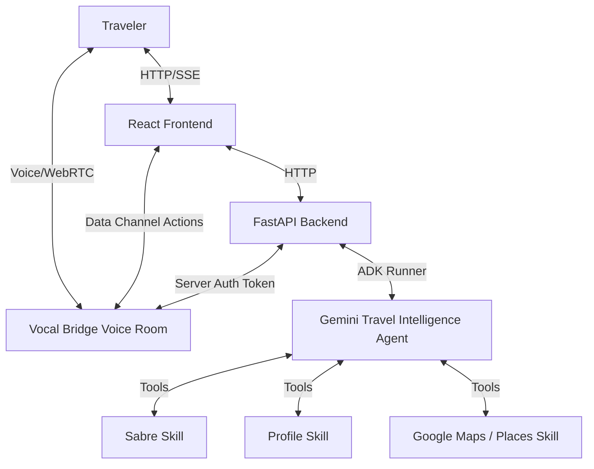

# System Architecture: TravelWell Voice

## 1. High-Level Diagram

---

## 2. Component Design & Reusability

### 2.1 Reused Unchanged
- **FastAPI Core App:** Endpoints structure, startup lifecycles, OTEL telemetry setup, and CORS config.
- **Frontend Dashboard Visuals:** Glassmorphic layout, TripContextCard, ItineraryTimeline, ActionStatusList, and ConversationTranscript.
- **Session Handling:** ARTIFACT_SERVICE and SESSION_SERVICE settings in backend app_utils.

### 2.2 Modified / Adapted
- **Backend Orchestrator (`app/agent.py`):** Consolidated into a single Travel Intelligence Agent using Gemini 2.5 Flash on Vertex AI (via ADK and Vertex AI SDK), with skills defined as tool functions.
- **Frontend WebRTC Integration (`App.tsx` & `VoicePanel.tsx`):** Replace preview dropdown mockup with `@vocalbridgeai/sdk` LiveKit/WebRTC logic.
- **Backend Router (`fast_api_app.py`):** Add `POST /api/voice-token` for token generation.

---

## 3. Data Flow
1. **Initiate Voice session:** Frontend triggers request to `/api/voice-token` -> Backend requests Vocal Bridge API -> Returns connection details -> Frontend opens WebRTC channel.
2. **Dialogue Loop:** Traveler speaks -> Vocal Bridge processes speech -> Backend agent reasons using context:
   - `get_trip_context()` (Sabre API)
   - `get_traveler_profile()` (Traveler profile DB/mock)
3. **Reasoning & Skills execution:** Agent calls appropriate skills (e.g. `check_lounge_options`, `find_dining_retail_wellness`).
4. **Interactive Update:** Agent verbalizes suggestion and triggers client action `update_itinerary_preview` or `request_action_approval` to update the UI timeline live.
