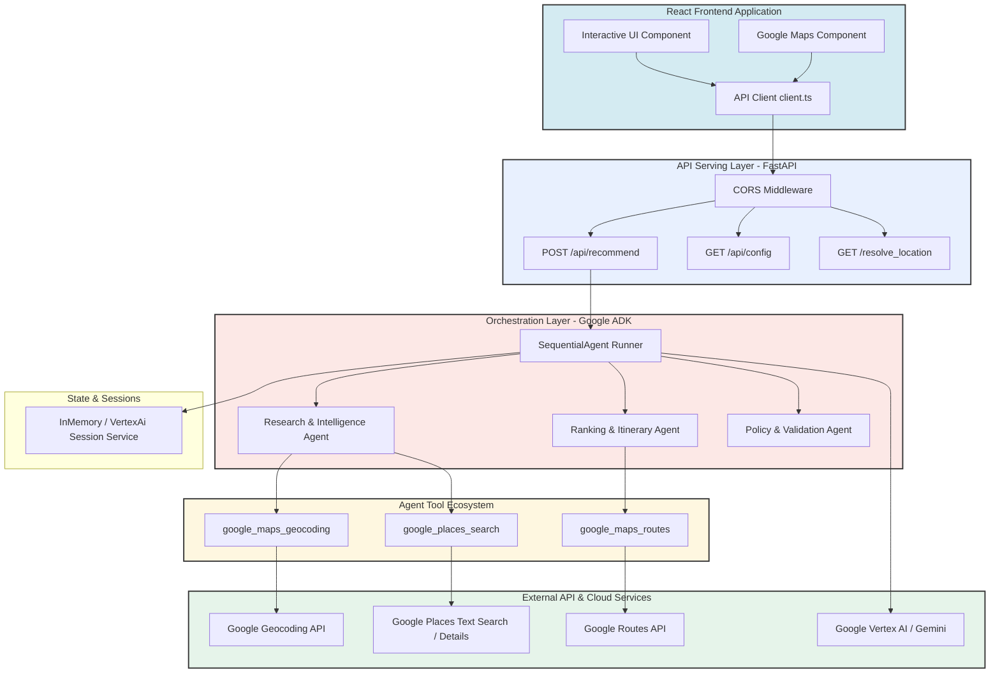
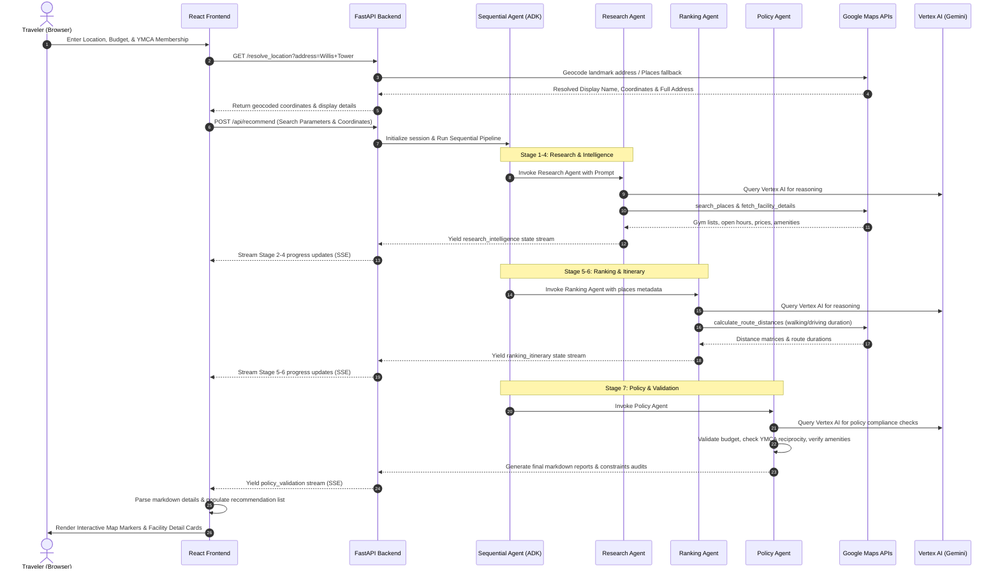
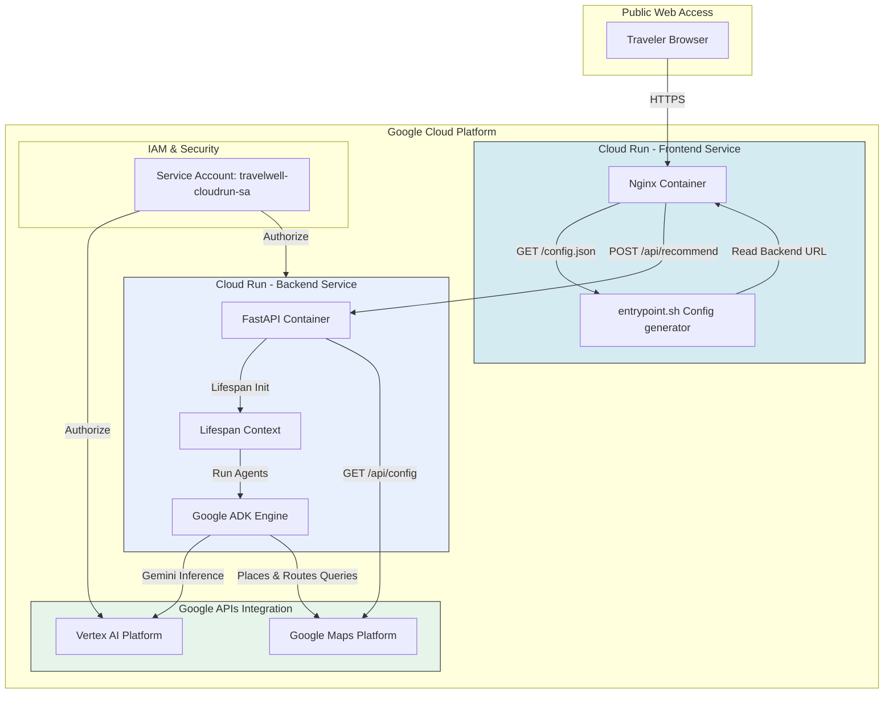

# TravelWell AI Architecture Specification

TravelWell AI utilizes a hybrid architecture featuring a Python backend powered by the Google Agent Development Kit (ADK) and FastAPI, combined with a TypeScript/React frontend.

---

## Component Diagram

The following diagram illustrates the relationship between the client application, API routing layer, ADK multi-agent orchestrator, tools, and external services:



---

## Execution Sequence Diagram

The diagram below details the sequence of interactions that occur from the moment a traveler submits a search query until the final explainable recommendation cards and map markers are rendered:



---

## Deployment & Infrastructure Diagram

The deployment model utilizes fully managed serverless infrastructure on Google Cloud Platform (GCP) to deliver low latency, high availability, and secure secret configuration management:



---

## Agent Specifications & Technical Details

### 1. Research & Intelligence Agent
*   **System Role:** Discovery and data aggregator.
*   **Model Engine:** Vertex AI / Gemini.
*   **Ecosystem Tools:**
    *   `google_places_search`: Performs nearby searches for candidate gyms and fitness centers within travel radiuses.
    *   `fetch_facility_details`: Resolves operational details (website, phone, user reviews, opening hours, cost/rates, pools, showers, and treadmills).
*   **Key Behavior:** Evaluates raw text queries and geocodes partial landmarks, neighborhoods, or addresses. Preserves uncertainty by mapping missing values to `None`/`Unknown` rather than hallucinating prices or amenities.

### 2. Ranking & Itinerary Agent
*   **System Role:** Geographical filter and path planner.
*   **Model Engine:** Vertex AI / Gemini.
*   **Ecosystem Tools:**
    *   `google_maps_routes`: Queries routing tables to compute walking and driving coordinates, distances, and duration intervals between the traveler's coordinates and target venues.
*   **Key Behavior:** Calculates transit durations, applies proximity scores, and formats a list of travel recommendations based on distance limits.

### 3. Policy & Validation Agent
*   **System Role:** Decision compiler and compliance auditor.
*   **Model Engine:** Vertex AI / Gemini.
*   **Key Behavior:** Iterates deterministically over gym pricing, time windows, and user preferences. Handles logic checks:
    *   *YMCA Reciprocity Rule:* If the user has a YMCA membership and the facility name indicates YMCA, marks pricing access status as "free" with $0 guest pass requirements.
    *   *Budget Constraints Check:* Discards facilities with known guest pass rates above the user's budget.
    *   *Amenity Enforcement:* Double-checks mandatory amenities (showers/parking) and rates confidence statuses (*Excellent Match*, *Good Alternative*, *Limited Match*).

---

## Repository Project Layout

```
travelwell-ai/
├── README.md                   # Project overview, quickstart & feature list
├── .agents-cli-spec.md         # Google ADK CLI runtime configuration schema
├── docs/
│   ├── ARCHITECTURE.md         # Current file (Technical specification & diagrams)
│   ├── API_CONTRACTS.md        # REST endpoint specifications & schema payloads
│   └── PROJECT_CHARTER.md      # Strategic overview & target product milestones
├── backend/                    # Python FastAPI & Google ADK backend app
│   ├── app/
│   │   ├── app_utils/          # Core helpers, session registry & logging hooks
│   │   ├── services/           # Google Maps Geocoding, Places, and Routes wrappers
│   │   ├── tools/              # ADK tool definitions bound to Google APIs
│   │   ├── agent.py            # ADK agent cards, system prompts & sequential routes
│   │   └── fast_api_app.py     # FastAPI application and public REST /api/recommend endpoint
│   ├── tests/                  # Integration, unit, and rate-limit resilient tests
│   └── pyproject.toml          # Package configuration & UV dependency declarations
└── frontend/                   # React TypeScript frontend app
    ├── src/
    │   ├── api/
    │   │   └── client.ts       # SSE event-stream parser & REST endpoints connector
    │   ├── App.tsx             # Interactive dashboard, maps synchronizer & timeline tracker
    │   └── main.tsx
    ├── entrypoint.sh           # Dynamic container config.json generator
    └── package.json
```
